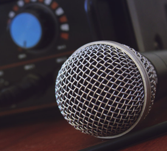
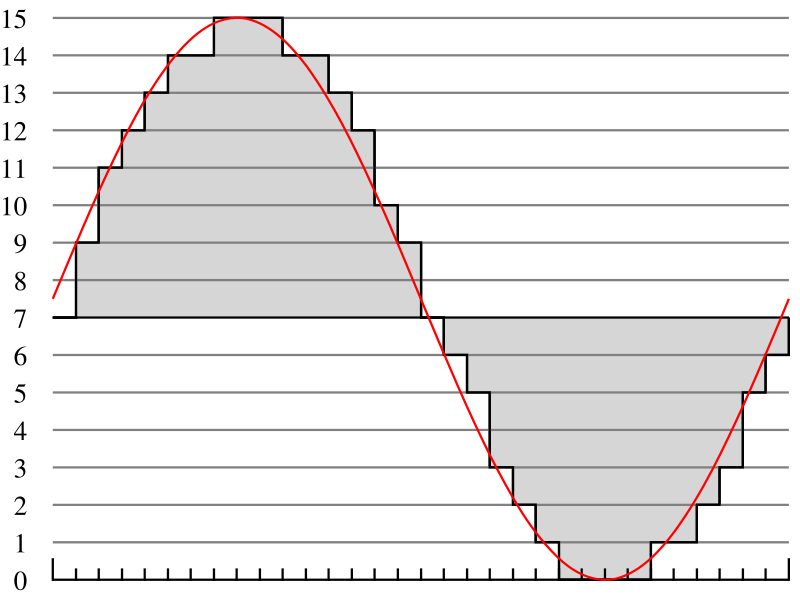
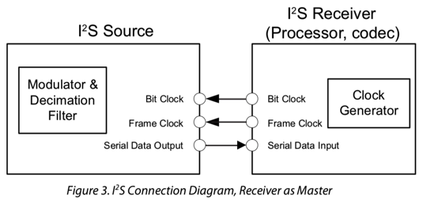
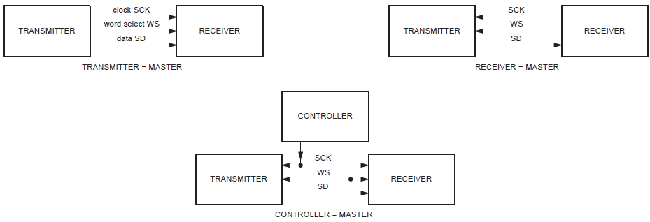
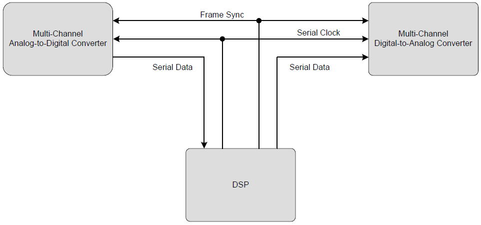
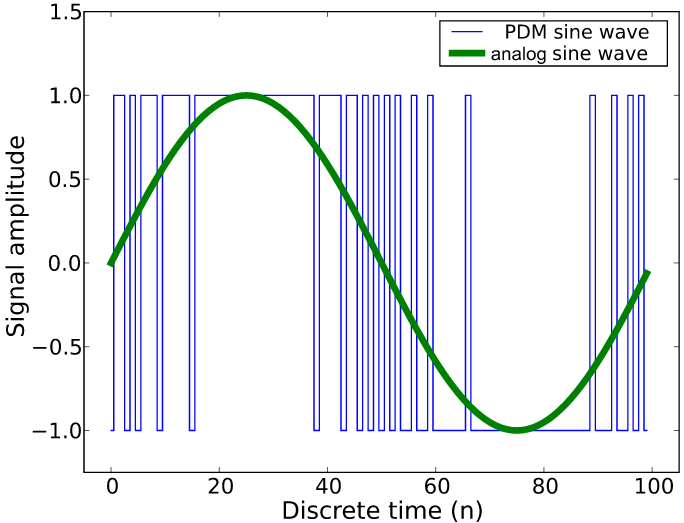
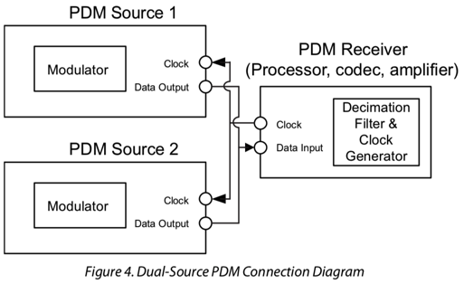

# 音频知识

硬件知识中，和音箱相关的知识有很多。现整理如下。

## `音频功率放大器` 和 `前置音频功率放大器`

下面整理 前置音频功率放大器 和 音频功率放大器 的区别和关系：

* `preamp`=`Pre-Amplified`=`preamplifier`
  * 中文名：`前置放大器`=`前置音频放大器`
  * 功能：
    * a preamp boosts a weaker signal to line level
      * 前置放大器将较弱的信号提升至线路电平
    * To clean up a signal so that it sounds better
      * 清理噪音使得声音更清楚
    * To adjust the signal, using a volume control, an equalizer, etc.
      * 允许支持通过音量控制器，均衡器等调整音频信号
    * To blend multiple signals into one
      * 允许支持多声音声音混音合并在一起
  * 作用：
    * 主要用于`麦克风`（=`microphone`=`mic`）领域
      * 
      * 所以一般所谓的：`preamplifier`=`mic preamp`
        * 对于硬件拆解看到的`前置音频功率放大器`，很多拆解报告中称为`麦克风`=`mic`
        * 所以：`麦克风`=`前置音频功率放大器`
  * 目的：
    * 改善麦克风音频性能及灵敏度
* `amp`=`poweramp`=`audio power amplifier`
  * 中文名：`放大器`=`音频放大器`=`音频功率放大器`=`功放`
  * 作用：
    * an amplifier boosts a line level signal so that it can be sent to speakers
    * 放大器提升线路电平信号，以便将其发送至扬声器
  * 目的：
    * 使得喇叭扬声器能够放出声音

### 举例

麦克风输出一个非常微弱的信号，需要通过前置放大器提升到与其他信号相同的电平，然后才能被其他设备（如混音器，接收器或放大器）处理。一旦它处于同一水平，它就可以用其他输入信号处理，并通过功率放大器发送到一组扬声器。

* 问：为何不把两个设备poweramp和preamp合并成一个设备？
* 答：理论上是可以的，但是一般采用分开独立芯片
* 原因：前置放大器通常保持分离的原因是为了使其远离电源中的大型变压器产生的噪声。
  * 注：
    * 前置放大器功耗很低-》使用很少的能量
    * 而功率放大器使用很多并产生大量的热量

## 常见音频接口和协议标准

之前知道I2S和PCM，但是没听过TDM和PDM。而对于这些技术的细节，不太懂，也不需要太懂。

下面主要从典型使用场景来解释具体区别和用法：

### 音频背景知识

* 音频类型
  * `analog audio`=`模拟音频`
    * 就是功放输出的，驱动音箱和喇叭的音频
    * 模拟麦克风采样回来的数据也是模拟音频
      * 通常会有单端或差分两种信号
  * `digital audio`=`数字音频`
    * 不能直接驱动喇叭
      * 必须要通过DAC转换成模拟音频，才能发出声音来
    * 音频数字化后的编码格式
      * PCM
      * PDM
* 音频传输场景 -》不同类型的接口
  * 同一块`电路板内部`的：IC芯片和IC芯片之间（传输音频数据）
    * `I2S`
    * `TDM`
    * `PDM`
  * 电路板A和`电路板`B`之间`的：用电缆数据线连接（传输音频数据）
    * PCM ？
      * PCM接口常用于板级音频数字信号的传输
    * S/PDIF
    * Ethernet AVB
  * 电脑`PC`的Audio`子系统`声卡的应用
    * Intel HDA (Intel High Definition Audio)

### 音频芯片设计历史演化

典型的音频的输入和输出的处理过程：

现代产品设计中用到的音频芯片（audio IC），尺寸越来越小

传统的音频芯片都是模拟芯片的尺寸较大，使用器件较多，所以越来越不适用

-》对比：

* 图1：传统的音频电路：中有麦克风、前置放大器、模/数转换器ADC、数/模转换器DAC、输出放大器，以及扬声器，它们之间使用模拟信号连接
* 图2：全数字音频电路：数字麦克风、DSP、输出放大器，以及扬声器，它们之间使用模拟信号连接

-》所以越来越多的音频都采用数字芯片了

且：抗干扰能力更强，硬件设计更简单

-》数字音频，就涉及到 接口定义，传输格式等内容，统称为：

DAI=Digital Audio Interfaces=数字音频接口

-》所以现在音频数据的传输，更多的涉及到了，上面提到的：

同一块电路板内部的：IC芯片和IC芯片之间

所以才有了先后的不同的音频传输标准的出现：I2S，TDM，PDM等等。

### 常见音频（传输）接口/标准总结

| 音频接口 | 中文+全称 | 主要（技术+应用）场景 | 备注说明 |
| -------| -------- | ------------------ | ------- |
| `PCM` | `Pulse Code Modulation`=`脉冲编码调制` | AP处理器和通信MODEM/蓝牙之间也是通过PCM来传输语音数据（就是双向打电话的数据）|通过等时间隔（即采样率时钟周期）采样将模拟信号数字化的方法   4-bit PCM的采样量化  接口上传输的音频数据通过PCM方式采样得到的 |
| `I2S` | `Inter-IC Sound` =`Integrated Interchip Sound` =`IIS` =`IC间音频` | 最早的：CD播放器 I2S速度快，专门用于传音乐 |   飞利浦在1986年定义（1996年修订）的数字音频传输标准，用于数字音频数据在系统内部器件之间传输，例如编解码器CODEC、DSP、数字输入/输出接口、ADC、DAC和数字滤波器等。  I2S是比较简单的数字接口协议，没有地址或设备选择机制  在I2S总线上，只能同时存在一个主设备和发送设备。  主设备可以是发送设备，也可以是接收设备，或是协调发送设备和接收设备的其它控制设备。  在I2S系统中，提供时钟（SCK和WS）的设备为主设备。   I2S设备连接示意图  在高端应用中，CODEC经常作为I2S的主控设备以精确控制I2S的数据流。  多数音频ADC、DAC、DSP，与采样速率转换器，以及一些微控制器都带有I2S接口。  I2S包括两个声道（Left/Right）的数据，在主设备发出声道选择/字选择（WS）控制下进行左右声道数据切换。 一般只支持1路音频数据 通过增加I2S接口的数目或其它I2S设备可以实现多声道（Multi-Channels）应用。 |
| `TDM` | `Time Division Multiplexing` =`时分复用` | AP处理器和通信MODEM/I2S只能传2个声道的数据 -> PCM可以传多达16路数据，采用时分复用的方式，就是TDM ->像现在最流行的语音智能音箱的7麦克风矩阵，一般都是用TDM来传的数据，同时可以传输7路麦克风输入和3路以上的音频反馈信号|TDM不像I2S有统一的标准，不同的IC厂商在应用TDM时可能略有差异，这些差异表现在时钟的极性、声道配置的触发条件和对闲置声道的处理等。  特点： 比I2S节省管脚数量 支持多路传输 最多支持16路=16通道   TDM系统框图 |
| `PDM` | `Pulse Density Modulation`=`脉冲分时复用` | 手机和平板电脑等便携设备的音频  PDM在诸如手机和平板等对于空间限制严格的场合，即尺寸受限应用中优势明显，有着广泛的应用前景 -》在数字麦克风应用很广  手机cpu到蓝牙的通话实时音频和mp3 codec的音频接口|一种用数字信号表示模拟信号的调制方法 PCM使用等间隔采样方法，将每次采样的模拟分量幅度表示为N位的数字分量（N = 量化深度），因此PCM方式每次采样的结果都是N bit字长的数据。  PDM，只有2根线，传音乐，编码方式和I2S不同。   PDM方式表示的正弦波    PDM格式的音频信号可以在比如LCD屏这样Noise干扰强的电路附近走线（等于没说，这里指数字信号抗干扰能力相比于模拟信号更强，同样PCM也具有此优势）  基于PDM的架构不同于I2S和TDM之处在于，抽取滤波器（Decimation Filter）不在发送设备，而在接收设备内部。源端输出是原始的高采样率（oversample）调制数据，如Sigma-Delta调制器的输出，而不是像I2S中那样的抽取数据。基于PDM接口的应用降低了发送设备的复杂性，由于作为接收设备的CODEC内部集成抽取滤波器，因此系统整体复杂度大大降低。对于数字麦克风而言，通过使用面向CODEC或处理器制造的更精细硅工艺，而非传统麦克风使用的工艺，可以实现更高效率的抽取滤波器。|

#### 综合解释

* 传输单声道数据：PCM
  * 比如：麦克风
* 传输双声道数据：I2S
* 传输两个及以上声道的数据：TCM

#### PCM vs PDM vs AC'97 vs USB

* PCM：
  * 使用等间隔采样方法：将每次采样的模拟分量幅度表示为N位的数字分量（N = 量化深度）
  * 每次采样的结果都是N bit字长的数据
  * 逻辑更加简单
  * 需要用到数据时钟，采样时钟和数据信号三根信号线
* PDM：
  * 使用远高于PCM采样率的时钟采样调制模拟分量
    * PDM采样的音频数据 也常被叫做：Oversampled 1-bit Audio
  * 只有1位输出：要么为0，要么为1
  * 逻辑相对复杂
  * 只需要两根信号线，即时钟和数据

另外：

* AC'97
  * 不只是一种数据格式：用于音频编码的内部架构规格
    * 还具有控制功能
  * 比I2S优点：明显减少了整体管脚数
  * 一般来说，AC'97编解码器采用TQFP48封装
* USB：
  * 在很多外接的音频模块上，用的是USB音频
  * 像科大讯飞的多mic降噪模块，用的就是usb接口，方便调试
    * 不管用的什么接口，传输的都是PCM或者PDM编码的数字音频