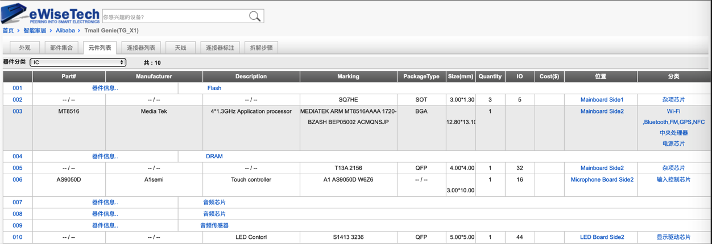
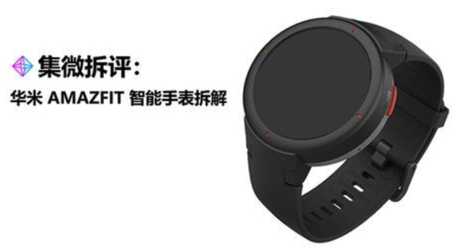
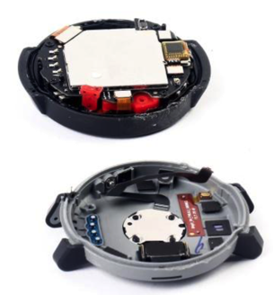
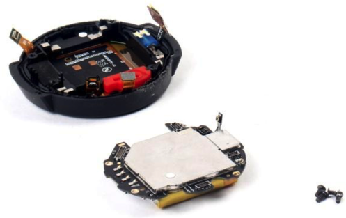
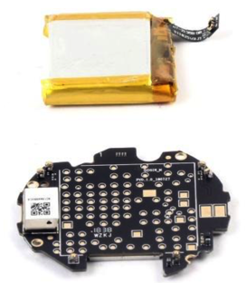
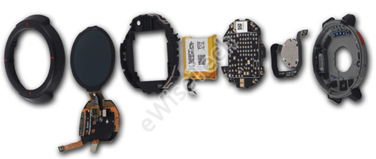
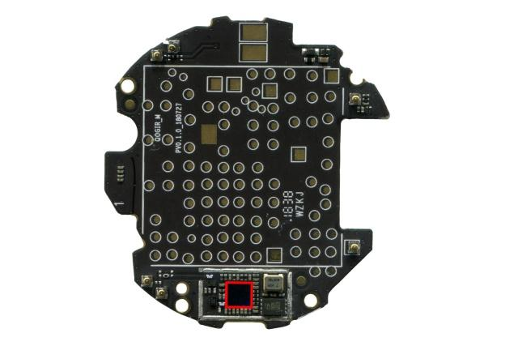
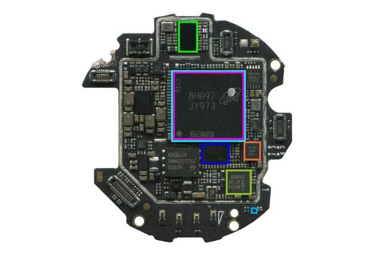
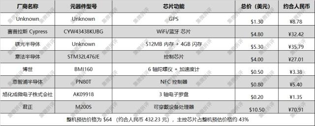

# BOM物料清单

## 什么是BOM物料清单

简单解释：电子设备有很多芯片和原器件组成，其中的用了哪些芯片和组件的清单，就叫做`BOM`=`物料清单`。

更详细的解释：

* BOM=Bill Of Materials
  * 直译：（产品所用的各种）材料的清单
  * 典型叫法：物料清单
  * 也叫做：
    * 材料清单
    * 用料表
    * 用料结构表
    * 用量表
    * 产品结构表
  * what：
    * 为了制造最终产品所使用的文件
  * 写了什么=包含了什么=记录了什么：
    * 原物料清单
    * 主/副加工流程
    * 各部位明细
    * 半成品与成品数量
    * 等
  * 作用：
    * 通常作为代工双方联系的文件或是公司内部沟通的文件
      * 代工双方：
        * 设计产品的公司
        * 帮忙生产的代工厂
  * 细分：
    * 根据目的不同可细分为：
      * E-BOM=Engineering BOM=工程BOM
      * P-BOM=Plan BOM=计划BOM
      * D-BOM=Design BOM=设计BOM
  * 和其他系统的关系
    * 是多种系统软件：
      * ERP=Enterprise Resource Planning=企业资源计划
        * -》
          * BOM是ERP的主导文件
          * BOM是ERP的基础数据
      * PDM=Products Data Management=产品数据管理
      * MRPⅡ=Manufacturing Resource Planning=物造资源计划
    * 的最基础的资料

-》此处典型的针对的是：一个电子设备，其中的各个硬件组成的清单列表

* 作为该产品的内部研发人员
  * 是该产品的设计和研发的参与者
    * 设计这个产品
    * 选用对应的各种的原器件
    * 最终找代工厂生产出该产品
    * 等等
  * -》本身就知道这些BOM物料信息
* 而作为普通用户或者数码评测机构：往往不知道该产品的BOM信息
  * 一般只能是：
    * 买了该产品
    * 拆了东西（的硬件）
    * 从硬件电路板上分析
      * 找出对应的硬件是哪些
  * -》最终分析出整个BOM物料清单

## BOM举例

### 天猫精灵方糖的BOM

详见：

[智能音箱拆解总结](http://book.crifan.com/books/smart_speaker_disassemble_summary/website)的[天猫精灵方糖C1的BOM物料清单](http://book.crifan.com/books/smart_speaker_disassemble_summary/website/tmall_genie_candy_cube/chip_info_research/disassembly_report_bom.html)

### 天猫精灵X1的BOM

### 华米AMAZFIT智能手表的BOM

大概的拆解过程：

最后得出BOM信息：

* 绿色：`Cypress`－`CYW43438KUBG`－WiFi蓝牙芯片
* 青色：`Micron`－512MB内存＋4GB闪存
* 紫色：`Ingenic`－`M200S`－双核处理器
* 蓝色：`STMicroelectronics`－`STM32L476JE`－控制芯片
* 橙色：`Bosch`－`BMI160`－六轴（陀螺仪＋加速度）传感器
* 浅绿色：`NXP`－`PN80T`－NFC芯片
* 浅蓝色：`AKM`－`AK09918`－三轴电子罗盘

及同一款产品来自[eWiseTech](https://www.ewisetech.com/Pub/Article/11419)的更详细的BOM表：

包括主板上使用的Logic、Memory、PM、RF芯片使用信息见下表：

<table>
  <thead>
    <tr>
        <th>Functional Area</th>
        <th>Brand Name</th>
        <th>Part Number</th>
        <th>Pkg Description</th>
    </tr>
  </thead>

  <tbody>
    <tr>
        <td>Logic</td>
        <td>Ingenic</td>
        <td>M200S</td>
        <td>Wearable Application Processor</td>
    </tr>
    <tr>
        <td rowspan="2">Memory</td>
        <td>Micron</td>
        <td>Unknown</td>
        <td>eMCP 512MB DRAM and 8GB ROM</td>
    </tr>
    <tr>
        <td>Gigadevice</td>
        <td>GD25LQ32</td>
        <td>1.8V Uniform Sector Dual and Quad Serial Flash</td>
    </tr>
    <tr>
        <td rowspan="3">PM</td>
        <td>STMicroelectronics</td>
        <td>STM32L476JE</td>
        <td>Ultra-low-power with FPU ARM Cortex-M4 MCU 80 MHz with 512 Kbytes Flash, LCD, USB OTG</td>
    </tr>
    <tr>
        <td>WILLSEMI</td>
        <td>WPM2006</td>
        <td>Power MOSFET and Schottky Diode</td>
    </tr>
    <tr>
        <td>Silicon Mitus</td>
        <td>SM5007</td>
        <td>Power Management</td>
    </tr>
    <tr>
        <td rowspan="3">RF</td>
        <td>Cypress</td>
        <td>CYW43438KUBG</td>
        <td>Single-Chip IEEE 802.11ac b/g/n MAC/Baseband/Radio with Integrated Bluetooth 4.1 and FM Receiver</td>
    </tr>
    <tr>
        <td>NXP</td>
        <td>PN80T</td>
        <td>NFC Controller</td>
    </tr>
    <tr>
        <td>/</td>
        <td>/</td>
        <td>GPS</td>
    </tr>
  </tbody>
</table>

整机上使用的MEMS芯片使用信息见下表：

<table>
  <thead>
    <tr>
        <th>Functional Area</th>
        <th>Brand Name</th>
        <th>Part Number</th>
        <th>Pkg Description</th>
    </tr>
  </thead>

  <tbody>
    <tr>
        <td rowspan="3">Sensor</td>
        <td>Bosch</td>
        <td>BMI160</td>
        <td>6-Axis (Gyroscope+Accelerometer)</td>
    </tr>
    <tr>
        <td>AKM</td>
        <td>AK09918</td>
        <td>3-Axis Electronic Compass</td>
    </tr>
    <tr>
        <td>/</td>
        <td>/</td>
        <td>Barometric Pressure Sensor</td>
    </tr>
  </tbody>
</table>
