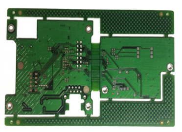
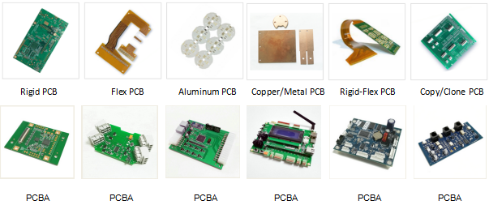
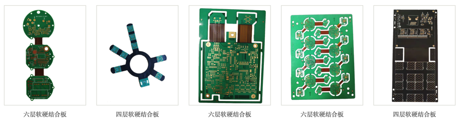
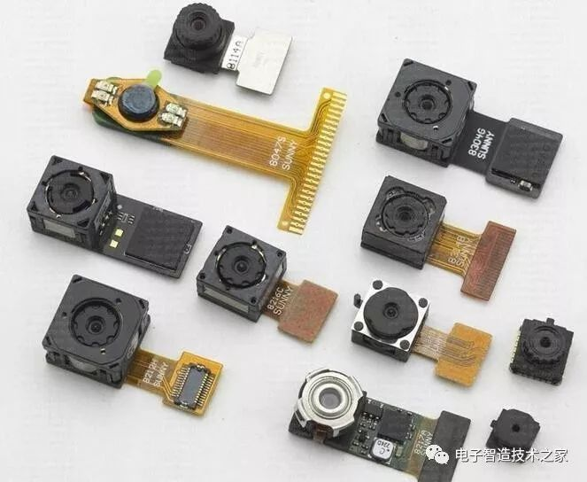
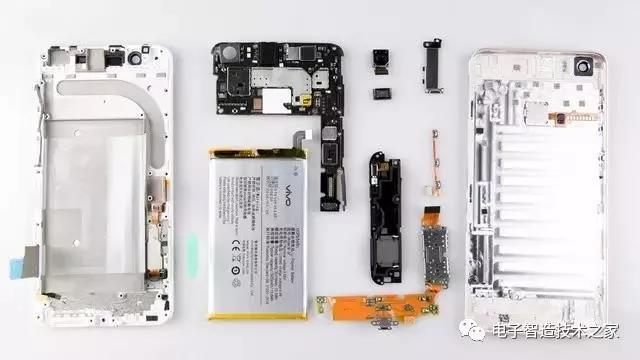
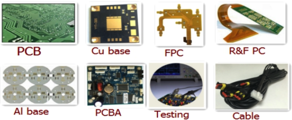
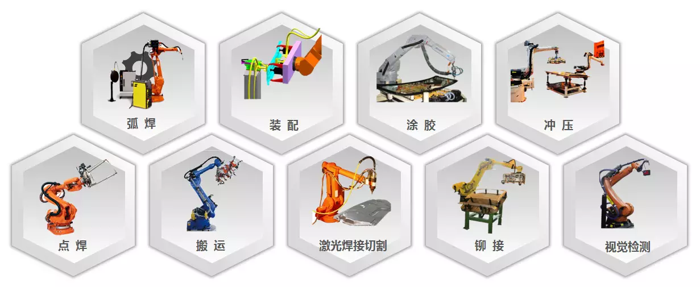

# PCB电路板

## 典型的硬件PCB电路板长啥样

* 没有装配原器件的PCB板
  * 
* 各种不同类型的PCB板
  * 

## PCB电路板分类

能生产硬件电路板的厂家，还可以生产各种类型的开发板：

* 按层数分
  * 举例
    * 
  * 分类
    * 双面软硬结合板
    * 三层软硬结合板
    * 四层软硬结合板
    * 五层软硬结合板
    * 六层软硬结合板
    * 八层软硬结合板

## PCB电路板的发展历史

* 背景
  * 电子产品用到`PCB电路板`
    * PCB的质量直接影响到电子产品的品质
* 电子产品 发展方向：
  * 轻薄化
  * 小型化
* PCB电路板方向：
  * 从刚性到柔性
  * 从单层到多层
* 最近：
  * FPC成为了PCB细分行业的领跑者

### FPC 柔性电路板

* `FPC`=`Flexible Printed Circuit`=`柔性电路板`
  * 解释
    * 以聚酰亚胺或聚酯薄膜为基材制成的一种具有高度可靠性，绝佳的可挠性印刷电路板
  * 特点
    * 配线密度高
    * 重量轻
    * 厚度薄
    * 弯折性好
* 应用
  * iPhone
    * iPhone上的FPC多达16片
      * 
    * 哪些功能用到了FPC
      * AMOLED屏
      * 无线充电
      * 3D人脸识别
      * 双玻璃外观
    * iPhone拆了是啥样
      * 

## PCB装配生产线

一站式服务 = One Stop PCB and PCB assembly Service

### 生产制造PCB电路板所用到的设备

生产PCB电路板等硬件涉及到很多工序，用到很多设备。

* 工序
  * 弧焊
  * 装配
  * 涂胶
  * 冲压
  * 电焊
  * 搬运
  * 激光焊接切割
  * 铆接
  * 视觉检测
* 用到设备和工业机器人
  * 
