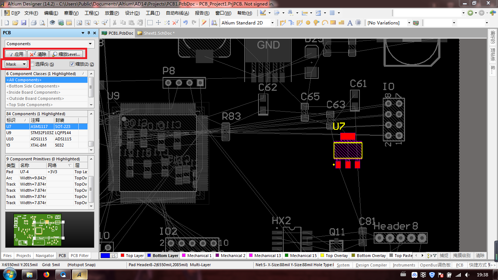
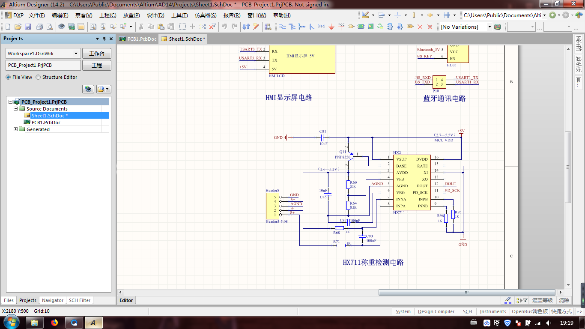
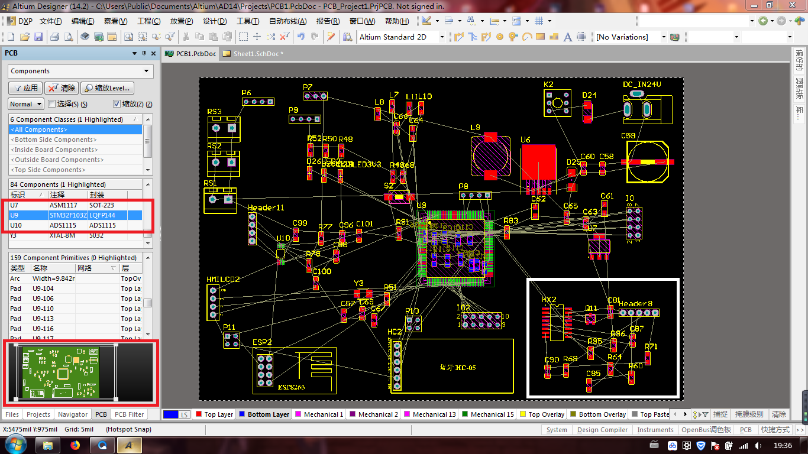
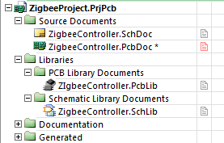
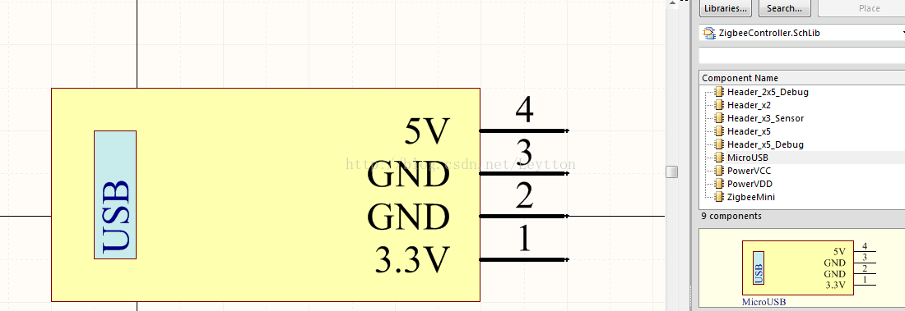
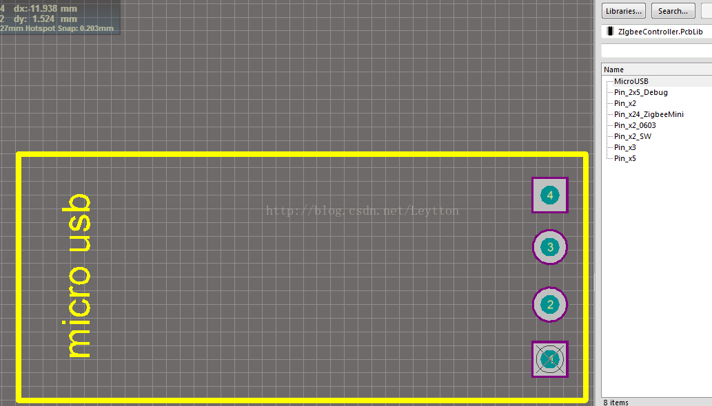
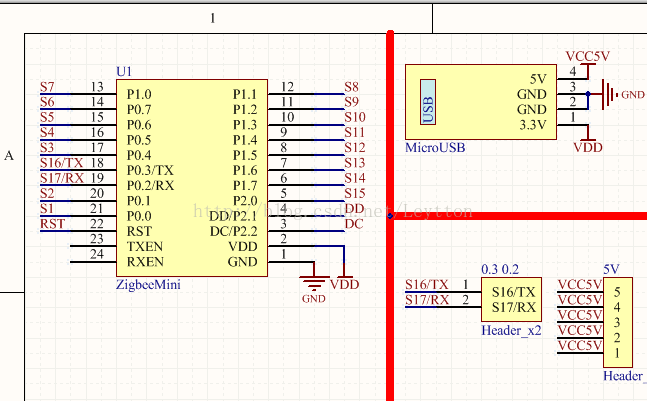
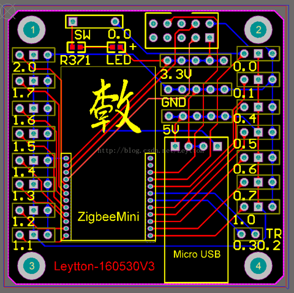
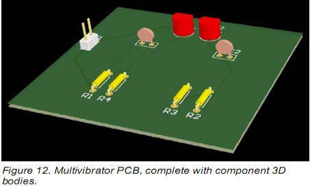

# PCB和芯片设计

## 用什么软件去设计和开发PCB电路板、芯片等硬件？

对于硬件设计，包括IC，PCB电路板等等，也是有专业的工具软件的。

比如：

* `Altium Designer`

## Altium Designer

* Altium Designer长啥样
  * 
  * 
  * 
* 项目结构图
  * 
* 原理图库
  * 
* 封装库
  * 
* 原理图
  * 
* 封装图
  * 
* 3D实体显示
  * 