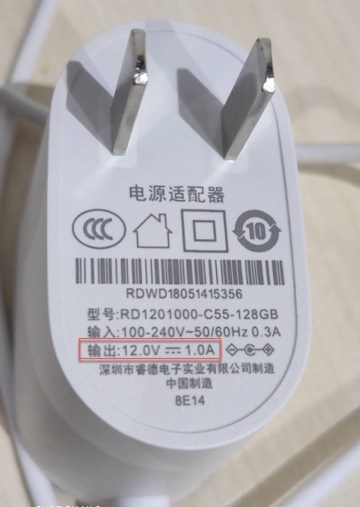

# 电源管理知识

硬件电路中，往往涉及到不同芯片的电源和供电，即电源管理方面的知识，下面进行详细介绍。

## 电压转换

此处电源管理中涉及到电压转换，下面详细介绍。

### 什么是降压变换器

* `降压变换器`=`降压转换器`
  * 英文：Buck Converter
  * 又称：
    * `DC-to-DC power converter`=`直流-直流转换器`
    * `step-down converter`
    * `Buck Chopper`=`降压斩波器`
  * 作用：
    * 降低电压的直流-直流转换器
      * 输出（负载）端的电压会比输入（电源）端要低
      * 但其输出电流会大于输入电流
  * 所属种类：开关电源=switched-mode power supply=SMPS

### 为何要降低电压？

* 为了实现在外接电压输入比较大时，内部原器件也可以正常工作
  * 背景：
    * 电路板的输入电压比较高，比如12V，
    * 电路板上的内部的原器件（比如USB，DRAM，CPU等）需要的工作电压是更低的，比如5V，3.3V，1.8V等等，
  * 所以：
    * 需要转换电压，内部原器件才能正常工作
    * 且同时要尽量保持高的电压转换效率
      * 否则不仅是能量转换效率低
      * 而且损失的能量转换的热量导致电路板散热问题

### 降压举例

在[智能音箱拆解总结 天猫精灵方糖BOM](http://book.crifan.com/books/smart_speaker_disassemble_summary/website/tmall_genie_candy_cube/chip_info_research/disassembly_report_bom.html)，期间所整理的信息：

* 外部输入电压较高：12V
  * =电源插头的输出电压：12V
    * 
* 电路板上各种芯片的工作电压比较低
  * =关于芯片的工作电压Vcc比较低
    * 主控SoC芯片 MTK MT8516：`1.15V`
    * Nand Flash存储芯片 Samsung K9F1G08U0F：`3.3V` (2.7V ~ 3.6V)
    * ADC芯片 TI ADC128D818：`3V ~ 5.5V`
    * 音频功放芯片 TI LMV1012：`2V ~ 5V`
    * 音频功放芯片 NXP TFA9895：`2.5V ~ 5.5V`
* -》所以需要电源管理芯片去降低电压
  * 输出合适的电流和电压
    * 以便于电路板上芯片可以正常工作

### 降压变换器 vs 线性稳压器

电压转换芯片常见有2类：

* LDO=`线性稳压器`
* DC-DC Converter=`降压变换器`=`直流-直流降压变换器`

现在整理如下：

* 降压变换器：即能实现电压转换，同时又能保证高的转换效率
    * 一般大于90%
* 与之对应的是：LDO=线性电压调节器
    * [线性电压调节器 - 维基百科，自由的百科全书](https://zh.wikipedia.org/wiki/線性電壓調節器)
    * 线性电压调节器（英语：Linear regulator）
        * 又称：
            * 线性稳压器
            * 线性调节器
        * 是一种元件
        * 作用：保持电压稳定
        * 原理：
            * 稳压器的电阻会因应负载及输入电压的变化，以达至输出电压稳定不变。其动作尤如一不停自动调节阻值的可变电阻，使之与负载得出的分压保持固定，而过程中因输出与输入电压差而多出的能量则以发热的形式消散掉
        * 所以一般转换效率很低
            * 比如：假若输出要求为2V，而压降电压同是2V，效率就是2V/(2V+2V)=50%左右
            * 这样低的效率，在实际应用上多不为接受
            * -》需要低压差稳压器（LDO）
