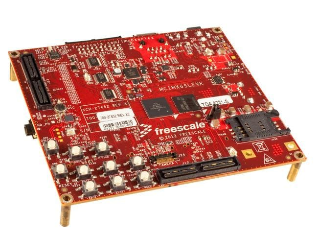
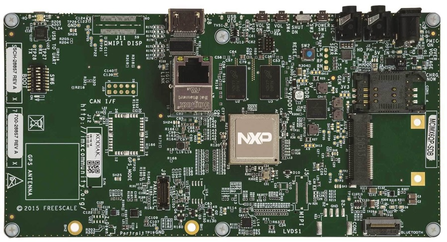

# 常见名词概念

此处整理嵌入式和硬件共有的常见名词、概念、逻辑。

这样就可以在硬件拆解期间、硬件研发期间、嵌入式研发期间等情况中，遇到不懂的名词，可以参考和了解是干啥的了。

## CPU=SoC=MCU=主控芯片

* `CPU`=`Central Processing Unit`=`中央处理器`
* `SoC`=`System On Chip`=`系统级芯片`=`片上系统`
* `MCU`=`Micro Control Unit`=`微控制器`

更多内容详见：

[芯片名词对比 · 芯片产业链总结](https://book.crifan.com/books/ic_chip_industry_chain_summary/website/ic_chip_summary/chip_names_compare.html)

## IC=Integrated Circuit=集成电路 = 芯片

详见：

[芯片简介 · 芯片产业链总结](https://book.crifan.com/books/ic_chip_industry_chain_summary/website/ic_intro/)

## Audio Amplifier IC=音频功放芯片

详见：

[音频知识 - 音频功率放大器和前置音频功率放大器](http://book.crifan.com/books/common_logic_hardware_embedded/website/hardware_common/audio_knowledge.html)

## `Part Number`和`Marking`

* `Part Number``芯片编号`=`你找芯片公司买芯片时报的名称`=`芯片公司内部的芯片的编号`
  * =`芯片名`=`Part#`= `Part NO` = `Part No` = `Part No.` = `PN`=`部件编号`= `零部件编号`=`芯片编号`
* `Marking`=`（电路板上的）芯片上印的名字`
  * =`Device Marking`=`打标`=`芯片标记`=`package marking`

两者是相对应的关系。

举例：

* `14VF` -> `TI`的`TLV62568DBV`
  * [电源管理芯片](http://book.crifan.com/books/smart_speaker_disassemble_summary/website/tmall_genie_candy_cube/chip_info_research/power_management.html)
  * 中TI的：
  * `Part Number`：`TLV62568`系列中的`TLV62568DBV`的`TLV62568DBV`或`TLV62568DBVR`
  * `Device Marking`是`14VF`

### Part Number举例

比如之前在：

[智能音箱拆解总结](http://book.crifan.com/books/smart_speaker_disassemble_summary/website)

期间所遇到的不同芯片的Part Number：

* SoC
  * `MTK MT8516`
  * `MTK MT2601`
  * `MTK MT7688AN`
  * `MTK MT8516`
  * `MTK MT2601`
  * `MTK MT8665NV`
  * `MTK MT8167`
* DC-DC转换器
  * `TI TLV62568`
* ADC
  * `TI TLV320ADC3101`
* 音频相关芯片
  * `TI TAS5733L`
  * `TI TAS5751M`
  * `TI TPA3110D2`
  * `TI TAS5760M`
* 存储芯片Nand Flash
  * `Samsung K9F1G08U0F`
* 音频功放芯片
  * `NXP TFA9895`
* [华米 AMAZFIT 智能手表拆解 - OFweek电子工程网](https://ee.ofweek.com/2019-02/ART-8330-2801-30306436_3.html)
  * `Cypress CYW43438KUBG`
  * `Ingenic M200S`
  * `STM STM32L476JE`
  * `NXP PN80T`
  * `AKM AK09918`

## Package Type=封装方式

=`PKG Type`=`封装类型`

详见：

[封装类型](http://book.crifan.com/books/common_logic_hardware_embedded/website/hardware_common/common_package.html)

## 上位机

* 和电子设备相对应的（通过数据线连接了电子设备的）电脑，就叫做上位机
  * 一般都是通过数据线和电子设备相连接，然后在电脑端安装相关软件可以操作和控制电子设备

### 上位机 举例

* POWER-Z KT001可搭配上位机使用
  * [POWER-Z KT001更新日志：使用说明书、固件客户端下载以及常见问题解答 – 充电头网](http://www.chongdiantou.com/wp/archives/17392.html)
  * 和：
  * [一键测PD：POWER-Z家族再添新成员](https://mp.weixin.qq.com/s?__biz=MzIzNjEwOTA1MA==&mid=2650449266&idx=2&sn=cb6479d9f81a49877d5539d31406205e)
  * 就有对应的软件，在电脑上安装后，可以实时（抓包）设备中的信号并显示和绘制波形图，轻松查看电流电压变化

## `portfolio`=`series`=`product series`=`产品系列`=`产品家族`

### portfolio举例

[LMV1012 用于高增益麦克风的模拟前置放大器 IC | 德州仪器 TI.com.cn](http://www.ti.com.cn/product/cn/LMV1012/description)

> The LMV1012 is an audio amplifier series for small form factor electret microphones. This 2-wire portfolio is designed to replace the JFET amplifier currently being used

就解释了，LMV1012是个产品系列，产品家族，包括：

* `LMV1012-07`
* `LMV1012-15`
* `LMV1012-20`
* `LMV1012-25`

## `develop suite`=`开发套件`=`develop tookit`=`开发组件`=`develop board`=`DevBoard`=`开发板`=`StartKit`=`开始（开发用的）开发套件`=`evaluation board`=`评估板`

### 评估板 举例

* TI TLV320ADC3101的评估板
  * [音频芯片](http://book.crifan.com/books/smart_speaker_disassemble_summary/website/tmall_genie_candy_cube/chip_info_research/audio.html)中的`ADC`芯片`TI TLV320ADC3101`，还推出了供开发使用的评估板
    * [TLV320ADC3101EVM-K TLV320ADC3101 评估模块和 USB 母板 | 德州仪器 TI.com.cn](http://www.ti.com.cn/tool/cn/TLV320ADC3101EVM-K?keyMatch=TLV320ADC3101&tisearch=Search-CN-Everything)
* i.MX 6SoloLite的Development Boards
  * [i.MX 6SoloLite Applications Processor | Single Arm® Cortex®-A9 @1 GHz | NXP](https://www.nxp.com/products/processors-and-microcontrollers/arm-based-processors-and-mcus/i.mx-applications-processors/i.mx-6-processors/i.mx-6sololite-processors-single-core-low-power-epd-controller-arm-cortex-a9-core:i.MX6SL)
  * 中的：Development Boards
  * 
  * 和
  * [IMX6SLEVK: i.MX 6SoloLite](https://www.nxp.com/support/developer-resources/software-development-tools/i.mx-developer-resources/i.mx-6sololite-evaluation-kit:IMX6SLEVK)
  * [RD-IMX6QP-SABRE: SABRE Board for Smart Devices Based on the i.MX 6QuadPlus Applications Processors](https://www.nxp.com/support/developer-resources/evaluation-and-development-boards/sabre-development-system/sabre-board-for-smart-devices-based-on-the-i.mx-6quadplus-applications-processors:RD-IMX6QP-SABRE)
  * 的
  * 
