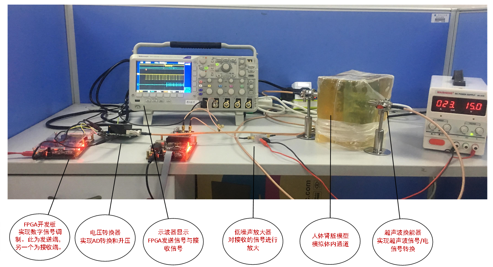
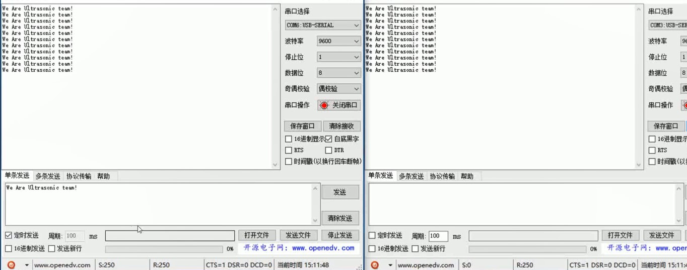

# 工作环境

对于硬件研发和嵌入式研发的典型工作环境是这样的：

比如[这里](http://www.openhw.org/productinfo/102938.html)的：

即：

* 一个工位
  * 除了一台电脑外
    * 电脑中用仪器和设备测量和检测各种参数
      * 
  * 还有各种
    * 电路板
      * FPGA开发板
      * 各种评估板
    * 仪器和设备：用于测试、测量、检测各种物理信号和参数
      * 示波器
        * 查看各种物理信号的波形
          * 是否符合对应协议标准
            * 比如测试USB协议波形
      * 电压和电流测量仪
        * 提供电源
          * 设置指定的电压和电流
          * 测量电压和电流大小